### 超简单超实用的  Flex  简单教程
##### Flex简介( 可略过 )
>Flex 是 Flexible Box的缩写，意思为弹性布局。传统的布局方式虽然很好用，也容易理解，但是有一定的局限性，比如 *垂直居中* 就不容易实现 。为了让布局变得更加快捷，2009年W3C提出了一种新的布局方式———Flex布局，目前已经得到了所有浏览器的支持。

### 1.Flex容器
任何容器都可以变为Flex容器。
>块级元素  
```
   .container{
      display:flex;
    }
```
>行内元素  
```
   .container{
      display:inline-flex;
    }
```

### 2.Flex项目以及Flex轴向
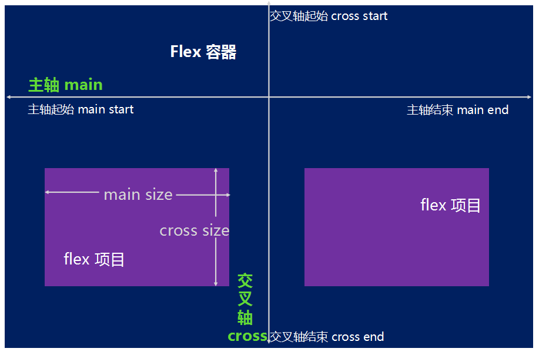

>使用flex布局的元素称之为flex容器，flex容器所包含的子元素，称之为flex项目。flex容器中存在两根特殊的轴，横向的称之为主轴 ( main ) , 纵向的称之为交叉轴 ( cross ) ，单个项目占据主轴的空间横向称之为`main size` ,占据主轴的纵向称之为`cross size`。

### 3.作用在容器上的属性 ( 有点多，耐心可以不大 )
>主轴轴向 `flex-direction`  
项目换行 `flex-wrap`  
轴向和换行简写 `flex-flow`  
主轴对齐 `justify-content`  
交叉轴对齐 `align-items`  
多根轴向对齐 `align-content`  

>为了给大家展示最佳的效果，这里我使用一个大的box容器，里边放6个小div，如下是css和html代码 ! ! !

```css
<style type="text/css">
			body,html{
				height: 100%;
			}
			.box{
				height: 670px;
				width: 1000px;
				background-color:#6495ED;
				position: relative;
			}
			.box div{
				height: 100px;
				width: 100px;
				box-sizing: border-box;
				border: 5px solid #FFC0CB;
				background-color: #3CB371;
				text-align: center;
				line-height: 100px;
				font-size:50px ;
				color: white;
				position: relative;
				top: 10px;
				margin: 10px;
			}
</style>
```
```html
<div class="box">
   <div>1</div>
   <div>2</div>
   <div>3</div>
   <div>4</div>
   <div>5</div>
   <div>6</div>
 </div>
```
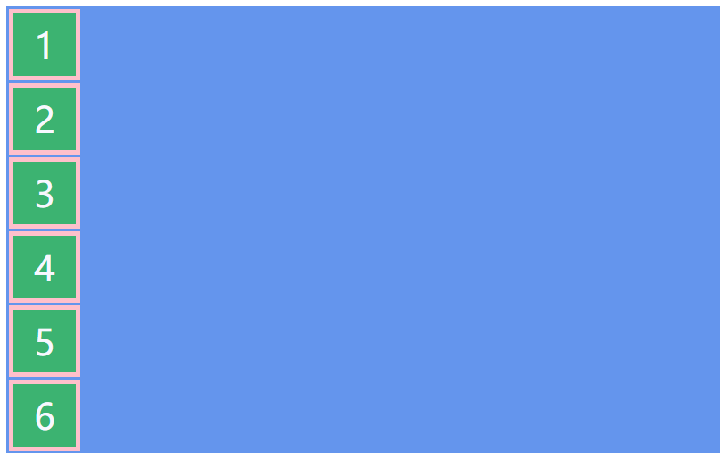
###  (1).  主轴轴向 ( flex-direction )

> **flex-direction** 决定主轴的方向，也就是容器中项目的排列方向  

>`flex-direction` : `row` (默认)  | `row-reverse` | `column` | `column-reverse`;  


>**不多BB，上效果**      

```css
//沿着主轴方向排列
.box{                                
     display: flex;
     flex-direction: row;
   }
```
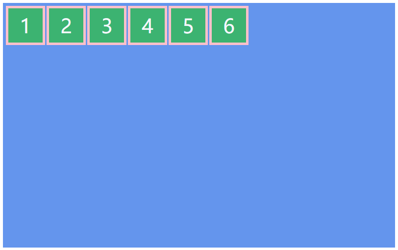
```css
//沿着主轴反方向排列
.box{                                
     display: flex;
     flex-direction: row-reverse;
   }
```   
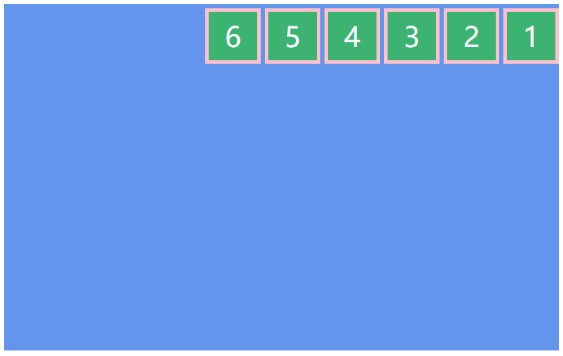
```css
//沿着交叉轴方向排列
.box{                                
     display: flex;
     flex-direction:column;
   }
```   
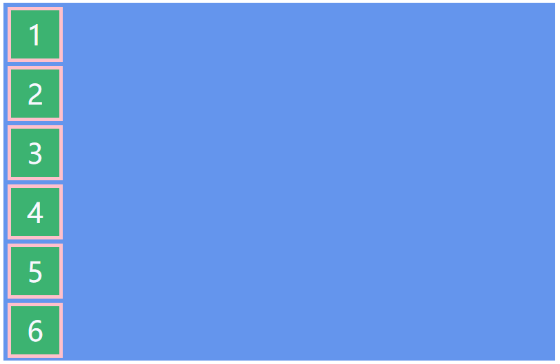

```css
//沿着交叉轴反方向排列
.box{                                
     display: flex;
     flex-direction:column;
   }
```   
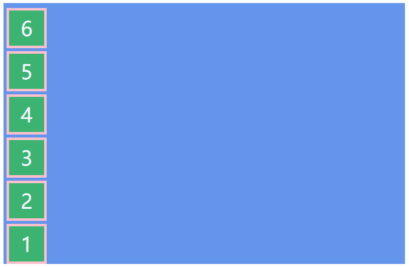

### (2).  项目换行 ( flex-wrap )

>**flex-wrap** 决定项目是否换行

>`flex-wrap` : `nowrap`（默认） | `wrap-reverse` | `wrap` ;

>**上代码了，准备好了吗**

```css
//默认不换行
.box{                                
     display: flex;
     flex-wrap: nowrap;
   }
```   
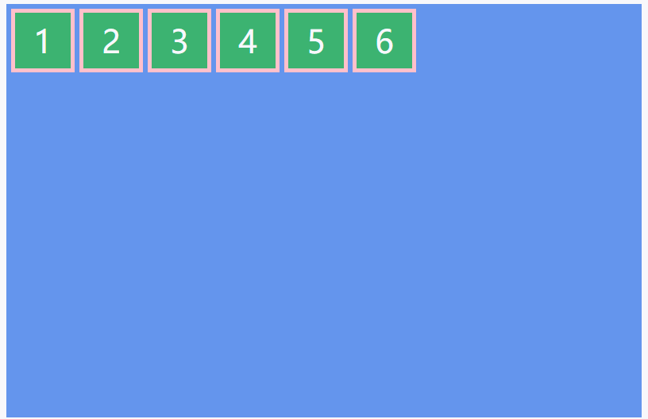

```css
//换行
.box{                                
     display: flex;
     flex-wrap: wrap;
   }
```   


```css
//反向换行
.box{                                
     display: flex;
     flex-wrap: wrap-reverse;
   }
```   
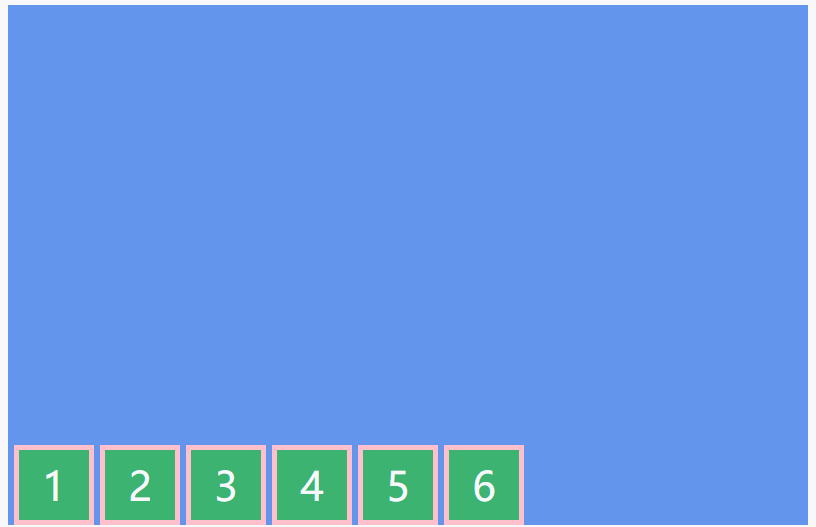


### (3). 轴向和换行简写 ( flex-flow )

>**flex-flow** 是主轴轴向和项目换行的简写

>`flex-flow` : `[flex-direction]  [flex-wrap]`;  
默认为	`flex-flow: row nowrap`;


### (4). 主轴对齐 ( justify-content )
>**justify-content** 决定了项目在主轴上的排列方式

>`justify-content` : `flex-start`( 默认 ) | `flex-end` | `center` | `space-between` | `space-around`;

```css
//默认左对齐
.box{
    display: flex;
    justify-content: flex-start;
}
```
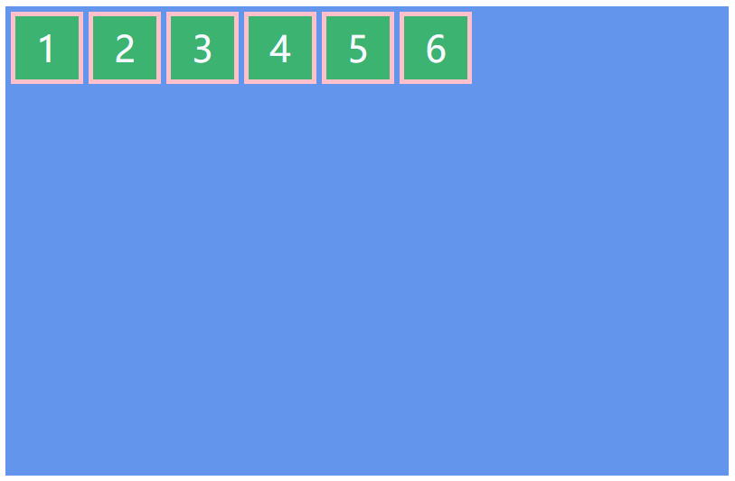
```css
//右对齐
.box{
    display: flex;
    justify-content: flex-end;
}

```
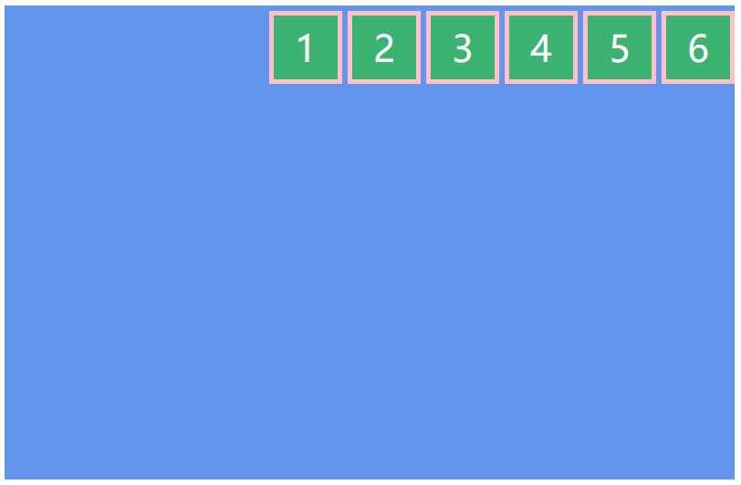
```css
//居中对齐
.box{
    display: flex;
    justify-content:center;
}

```
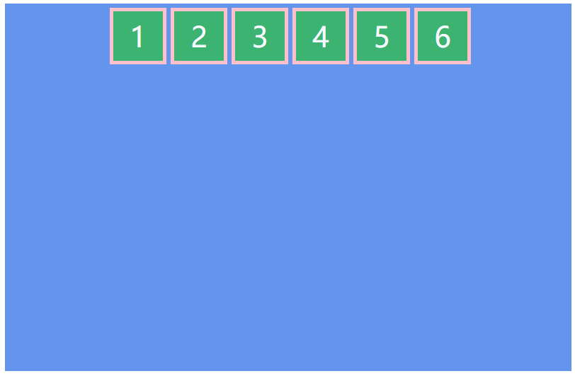
```css
//两端对齐，项目之间的间隔都相等。
.box{
    display: flex;
    justify-content:space-between;
}

```
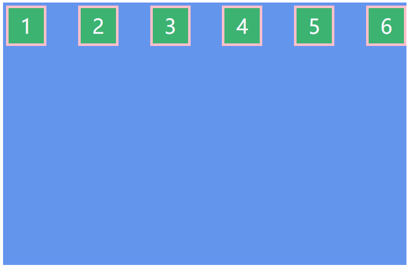
```css
//项目与项目之间的间隔是项目与容器边缘间隔的两倍
.box{
    display: flex;
    justify-content: space-around;
}

```
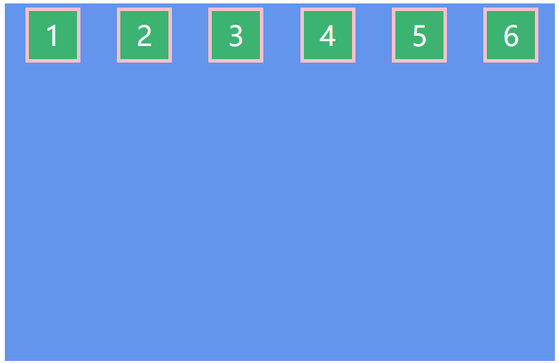

### (5). 交叉轴对齐 ( align-items )

>**align-itmes**  决定了项目在交叉轴上的对齐方式  

>`align-itmes` : `flex-start`( 默认 ) | `flex-end` | `center` | `beseline` | `stretch`;  

```css
//默认上对齐
.box{
		display: flex;
		align-items:flex-start;
}

```
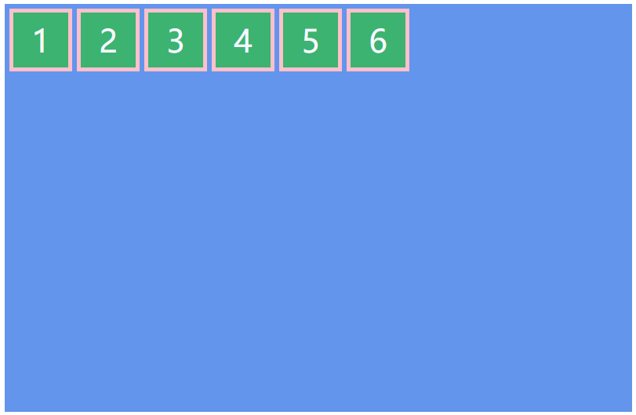

```css
//下对齐
.box{
		display: flex;
		align-items:flex-end;
}

```
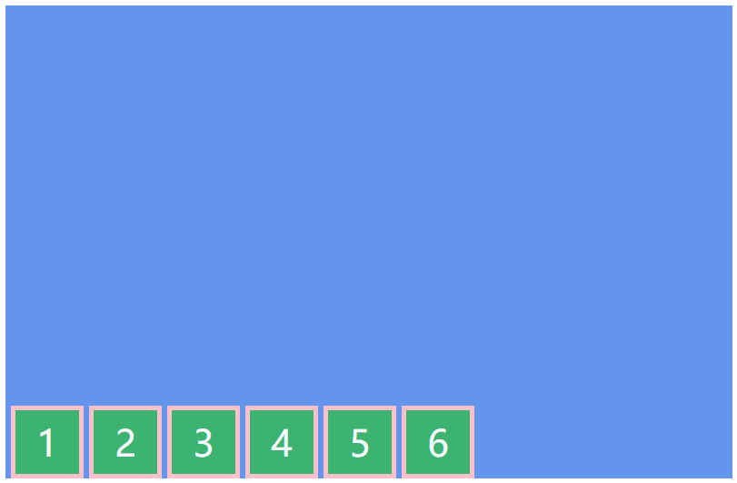

```css
//居中对齐
.box{
		display: flex;
		align-items:center;
}

```
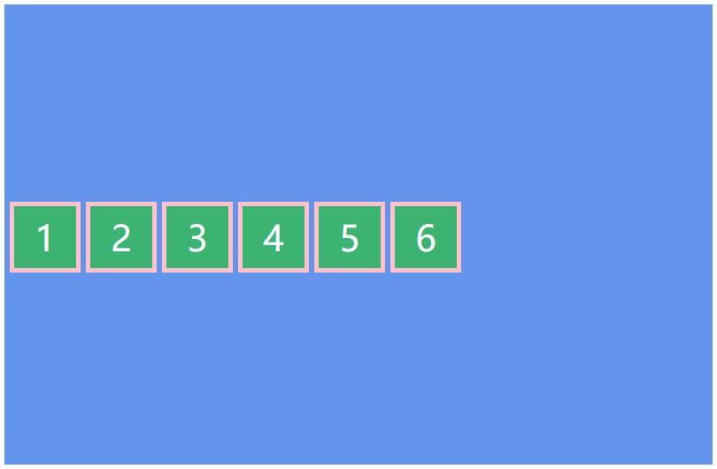

```css
//相对于文字底边对齐
.box{
		display: flex;
		align-items:baseline;
}

```
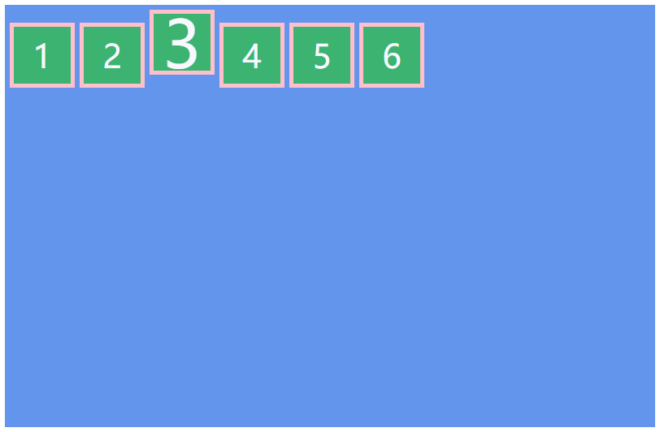

```css
//如果不设置项目高度(需要把div的高度去掉)，默认充满整个页面
.box{
		display: flex;
		align-items: stretch;
}

```
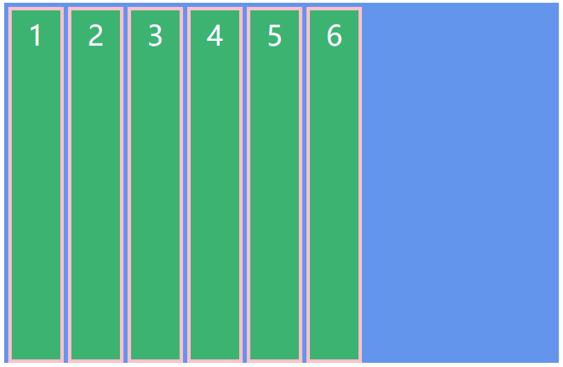


### 4.作用在项目上的属性
>项目排列属性 `order`  
项目放大比例 `flex-grow`  
项目缩小比例 `flex-shrink`  
项目占据主轴的空间 `flex-basis`  
项目对齐方式 `align-self`    

### (1) 项目排列属性 ( order )
>`order` 属性决定了项目在主轴上的排列顺序，默认为0，数值越小排列越前 ( 可以为负数 ) 。

```css
//给第三个div添加order属性
.box{
     display: flex;
}
.box div:nth-child(3){
	  	order: -1;
}
```
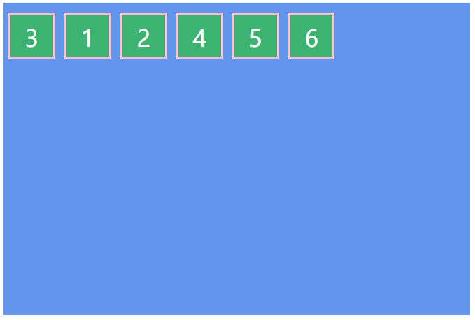


### (2) 项目放大比例 ( flex-grow )
>`flex-grow` 决定了项目的放大比例，默认为0，即即使主轴存在剩余空间也不放大。如果不为0，那么它所写的数值就是它所占主轴剩余空间的比例(听不懂没关系，下面展示例子)。

```css
//第三个div数值为1，第二个div数值为2
.box{
		display: flex;
}
.box div:nth-child(3){
		flex-grow: 1;
}
.box div:nth-child(2){
		flex-grow: 2;
}
```


### (3)项目缩小比例(flex-shrink)
>`flex-shrink`决定了项目在主轴上的缩小比例，默认为1，即如果主轴空间缩小，项目也将等比缩小。如果一个项目的此属性值为0，那么这个项目将不会随着主轴缩小而减小。下面看一个例子；

```css
//正常的缩小
.box{
		display: flex;
}
.box div:nth-child(3){
		flex-shrink: 1;
}
```
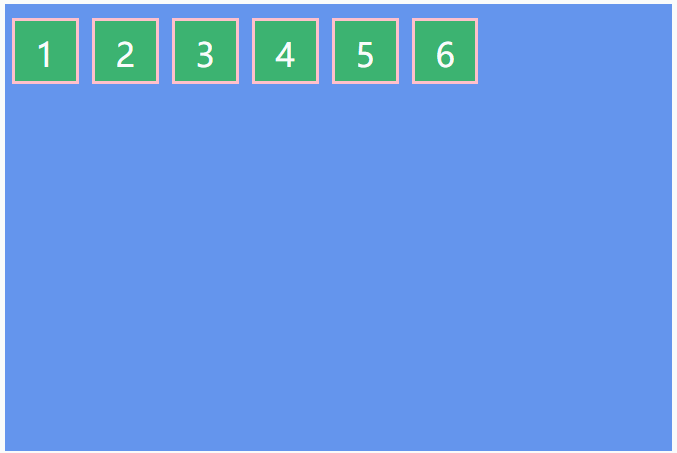

```css
//给第三个div设置值为0，此时它不在跟随缩小
.box{
		display: flex;
}
.box div:nth-child(3){
		flex-shrink: 0;
}
```


### (4)项目占据主轴的空间 ( flex-basis )
>`flex-basis`决定了项目占据主轴的空间，默认为auto，即项目本身的大小。当然，也可以设置以px为单位的数值。

```css
//给第三个div设置值独有的大小
.box{
		display: flex;
}
.box div:nth-child(3){
		flex-basis: 300px;
}
```
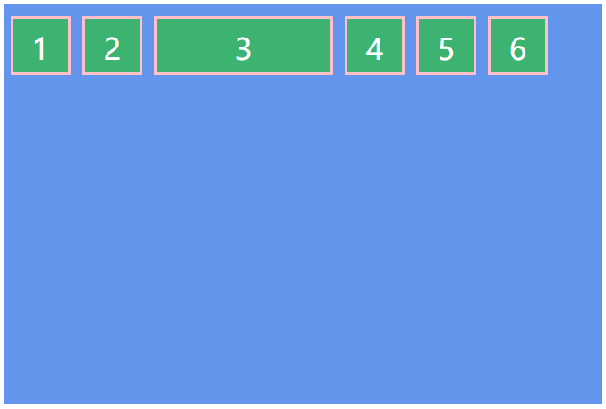

### (5)项目自身的对齐方式( align-self )
>`align-self` 是项目自身在交叉轴上的对齐方式，因为在有时候，有一些特殊的项目需要特殊的位置，所以我们进行了下面一个简单的例子。

>`align-self`:`flex-start` | `flex-end` | `center` | `baseline` | `stretch`;

```css
//给第三个div设置值独有的位置
.box{
		display: flex;
}
.box div:nth-child(3){
	  font-size: 50px;
	  align-self:flex-end;
}
```
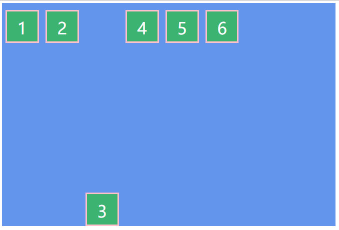
